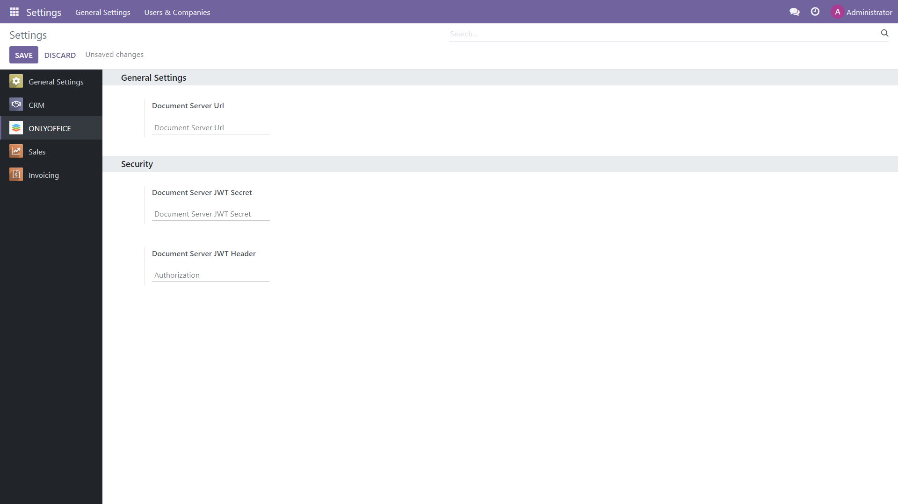

Prerequisites
=============

To be able to work with office files within Odoo, you will need an instance of Euro-Office Docs. You can install the `self-hosted version`_ of the editors (free Community build or scalable Enterprise version), or opt for `Euro-Office Docs`_ Cloud which doesn't require downloading and installation.

Euro-Office app configuration
============================

After the app installation, adjust its settings within your Odoo (*Home menu -> Settings -> Euro-Office*).
In the **Document Server Url**, specify the URL of the installed Euro-Office Docs or the address of Euro-Office Docs Cloud.

**Document Server JWT Secret**: JWT is enabled by default and the secret key is generated automatically to restrict the access to Euro-Office Docs. if you want to specify your own secret key in this field, also specify the same secret key in the Euro-Office Docs `config file`_ to enable the validation.

**Document Server JWT Header**: Standard JWT header used in Euro-Office is Authorization. In case this header is in conflict with your setup, you can change the header to the custom one.

In case your network configuration doesn't allow requests between the servers via public addresses, specify the Euro-Office Docs address for internal requests from the Odoo server and vice versa.

If you would like the editors to open in the same tab instead of a new one, check the corresponding setting "Open file in the same tab".

Contact us
==========

If you have any questions or suggestions regarding the Euro-Office app for Odoo, please let us know at https://forum.euro_office.com

.. _self-hosted version: https://www.euro_office.com/download-docs.aspx
.. _Euro-Office Docs: https://www.euro_office.com/docs-registration.aspx
.. _config file: https://api.euro_office.com/docs/docs-api/additional-api/signature/
